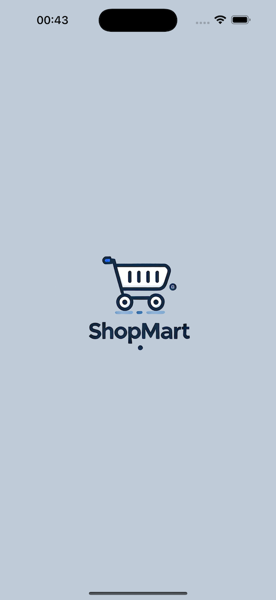
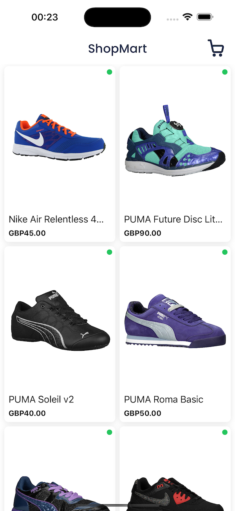
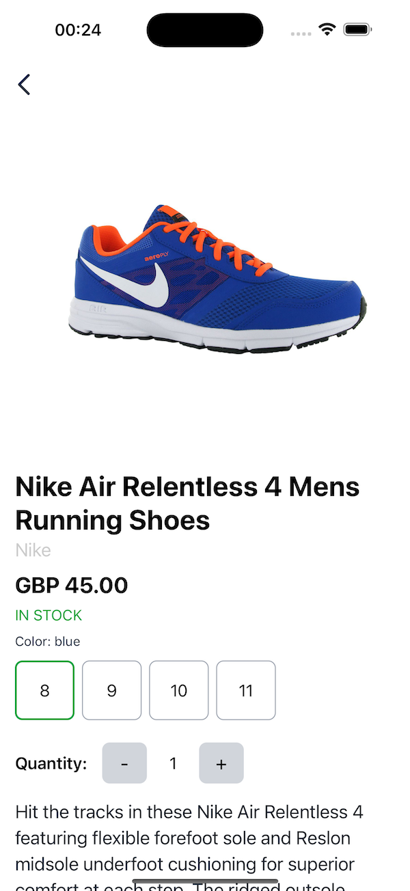
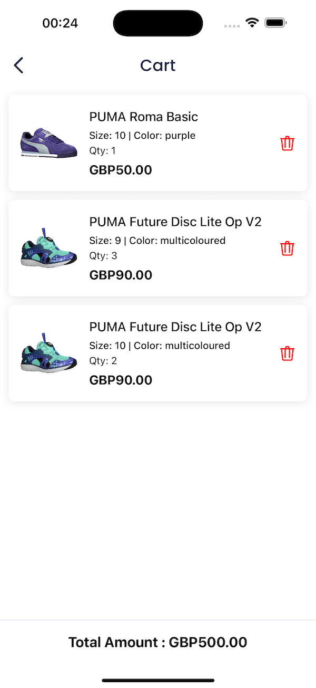

# Shopmart

Sample shopping cart app.

## App screens
<p align="center" >
  
  
  
  
</p>

<br/>

## Requirements
- iOS 12.0+
- Xcode 12+

## Environment setup
Follow these instructions to [environment setup](https://reactnative.dev/docs/environment-setup?guide=native).

## Installation

Clone the project (HTTPS / SSH)

```bash
  git clone https://github.com/jayanaka/ShopMart.git
```
or
```bash
  git clone git@github.com:jayanaka/ShopMart.git
```

Go to the project directory

```bash
  cd ShopMart
```
Install packages

```bash
  yarn install
```

Install iOS dependencies

Go to the iOS project directory

```bash
  cd ios
```
and run,
```bash
  pod install
```
Install android dependencies

Go back project directory

```bash
  cd //
```
Go to the android project directory

```bash
  cd android
```
and run,
```bash
  ./gradlew clean
```
## Run device
Run iOS device

```bash
  yarn run ios
```
Like `npm start`, but also attempts to open your app in the iOS Simulator if you're on a Mac and have it installed.

Run android device

```bash
  npx react-native run-android
```
Like `npm start`, but also attempts to open your app on a connected Android device or emulator. Requires an installation of Android build tools (see [React Native docs](https://facebook.github.io/react-native/docs/getting-started.html) for detailed setup). We also recommend installing Genymotion as your Android emulator. Once you've finished setting up the native build environment, there are two options for making the right copy of `adb` available to Create React Native App:

##### Using Android Studio's `adb`

1. Make sure that you can run adb from your terminal.
2. Open Genymotion and navigate to `Settings -> ADB`. Select “Use custom Android SDK tools” and update with your [Android SDK directory](https://stackoverflow.com/questions/25176594/android-sdk-location).

## Libraries
- @react-native-async-storage/async-storage : Storing simple, persistent data on a device
- @react-native-community/netinfo : Provides information about the network connectivity state of the device
- @react-navigation/native : library for implementing navigation in React Native apps.
- @reduxjs/toolkit : Library for managing state in React and React Native applications using Redux.
- redux
- axios : Used for making HTTP requests in web and mobile applications.
- nativewind : NativeWind allows you to use Tailwind CSS to style your components in React Native.
- react-native-fast-image : Used for handles image caching.
- react-native-indicators : Activity indicator.
- react-native-svg : React-native-svg allows you to use SVGs in your app.
- react-native-toast-message : Toast message component for React Native


## Directory Structure

```
root
├── __tests__
├── android
├── ios
├── node_modules
└── src
|   └── assets
|   |   ├── fonts
|   |   ├── icons
|   |   └── svgs
|   └── components
|   |   ├── Header
|   |   └── Product Item
|   └── constant
|   └── routes
|   └── screens
|   └── services
|   └── theme
|   └── utils
```

## Quick Overview

Quickly get an idea about each folder's role.

| Directory      | Short Description                                                        |
| :------------- | :----------------------------------------------------------------------- |
| android        | Android project. Includes modifications to integrate libraries.          |
| ios            | iOS project. Includes modifications to integrate libraries.              |
| src            | Most of the app's code is here.                                          |
| assets         | Shared images, icons, fonts etc.                                         |
| components     | Shared React components.                                                 |
| constant       | A set of predefined constants.                                           |
| context        | Context integration.                                                     |
| routes         | Root and tab navigator.                                                  |
| screens        | App screens.                                                             |
| services       | Axios base configurations                                                |
| theme          | Shared styles; app's theme.                                              |
